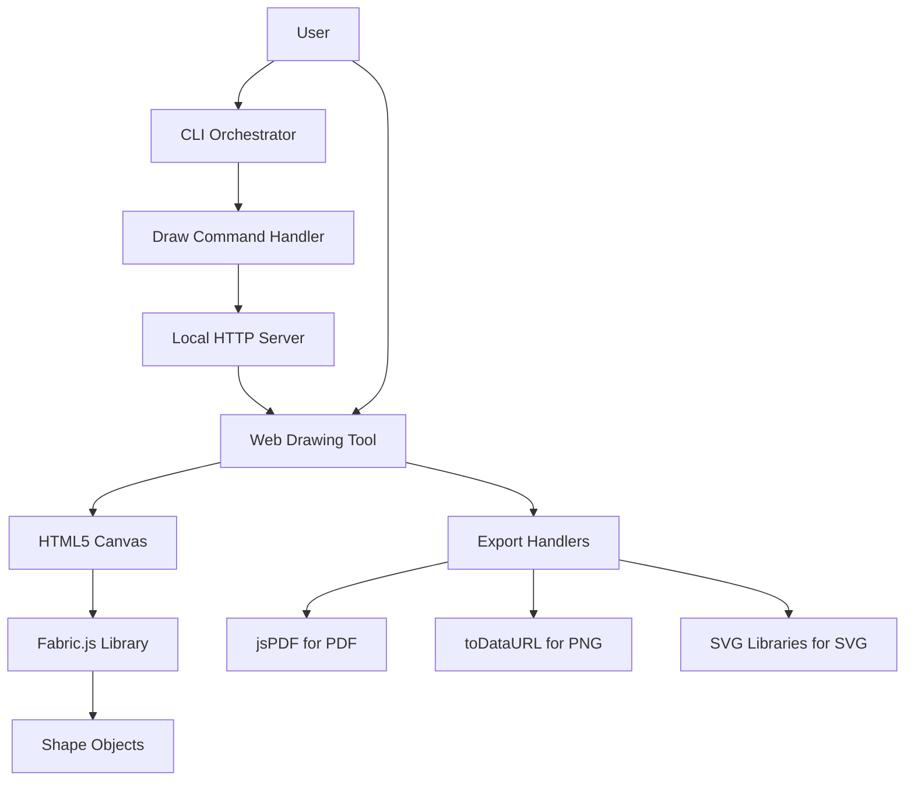

# High-Level Architecture Specification

## 1. System Overview
The HAAD system is a CLI-based orchestrator for workflow management, extended with a web-based drawing tool component. The drawing tool leverages HTML5 Canvas for interactive drawing, integrated as a standalone web application served via a local HTTP server triggered by a CLI command. This hybrid architecture maintains the core CLI functionality while adding browser-based drawing capabilities using JavaScript libraries for shape manipulation and export.

## 2. Component Diagram

## 3. Data Flow Strategy
- **CLI Command Execution**: User invokes the draw command via CLI, which validates Node.js availability and launches a local HTTP server to serve the web application.
- **Web App Initialization**: Server delivers HTML, CSS, and JavaScript files to the browser, initializing the Canvas element and attaching event listeners for drawing interactions.
- **Drawing Interactions**: User inputs (mouse/touch events) flow through JavaScript handlers to the Canvas API, creating and manipulating shapes via Fabric.js, with state managed in the DrawingCanvas model.
- **Export Operations**: User-triggered export requests route through export handlers, converting Canvas content to PNG, PDF, or SVG formats and prompting downloads.

## 4. Design Decisions
- **Web-Based Drawing Component**: Chosen to leverage HTML5 Canvas and JavaScript libraries for rich interactivity, despite the CLI core, to enable cross-platform drawing without native dependencies.
- **Fabric.js Integration**: Selected for simplified shape creation and manipulation, reducing complexity compared to vanilla Canvas operations while supporting SVG export.
- **Local Server Architecture**: Implemented via Node.js to serve the drawing tool, ensuring no external hosting requirements and seamless integration with CLI workflows.
- **Modular Export Formats**: Prioritized PNG for simplicity, with PDF and SVG added incrementally using dedicated libraries to support varied user needs without overcomplicating initial implementation.
