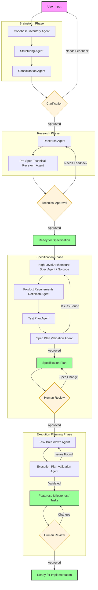

# HAAD Flow

```mermaid
graph TD
    UI[User Input] --> CIA[Codebase Inventory Agent]
    CIA --> ISA[Structuring Agent]
    ISA --> ICA[Consolidation Agent]
    ICA --> HC{Clarification}
    HC -- Needs Feedback --> UI
    HC -- Approved --> RA[Research Agent]
    RA --> PSTRA[Pre-Spec Technical Research Agent]
    PSTRA --> HC2{Technical Approval}
    HC2 -- Needs Feedback --> RA
    HC2 -- Approved --> HLAS[Ready for Specification]
    HLAS --> HLASA[High Level Architecture Spec Agent / No code]
    HLASA --> PRD[Product Requirements Definition Agent]
    PRD --> TPA[Test Plan Agent]
    TPA --> SPVA[Spec Plan Validation Agent]
    SPVA -- Issues Found --> HLASA
    SPVA -- Approved --> SP[Specification Plan]
    SP --> HR{Human Review}
    HR -- Spec Change --> SP
    HR -- Approved --> TBA[Task Breakdown Agent]
    TBA --> EPVA[Execution Plan Validation Agent]
    EPVA -- Issues Found --> TBA
    EPVA -- Validated --> FMT[Features / Milestones / Tasks]
    FMT --> HR2{Human Review}
    HR2 -- Changes --> FMT
    HR2 -- Approved --> RI[Ready for Implementation]

    subgraph Brainstorm Phase
        CIA
        ISA
        ICA
    end

    subgraph Research Phase
        RA
        PSTRA
    end

    subgraph Specification Phase
        HLASA
        PRD
        TPA
        SPVA
        SP
        HR
    end

    subgraph Execution Planning Phase
        TBA
        EPVA
        FMT
        HR2
    end

    style UI fill:#f9f,stroke:#333,stroke-width:2px
    style HC fill:#fff4dd,stroke:#d4a017,stroke-width:2px
    style HC2 fill:#fff4dd,stroke:#d4a017,stroke-width:2px
    style HR fill:#fff4dd,stroke:#d4a017,stroke-width:2px
    style HR2 fill:#fff4dd,stroke:#d4a017,stroke-width:2px
    style HLAS fill:#9f9,stroke:#333,stroke-width:2px
    style SP fill:#9f9,stroke:#333,stroke-width:2px
    style FMT fill:#9f9,stroke:#333,stroke-width:2px
    style RI fill:#9f9,stroke:#333,stroke-width:2px
```
